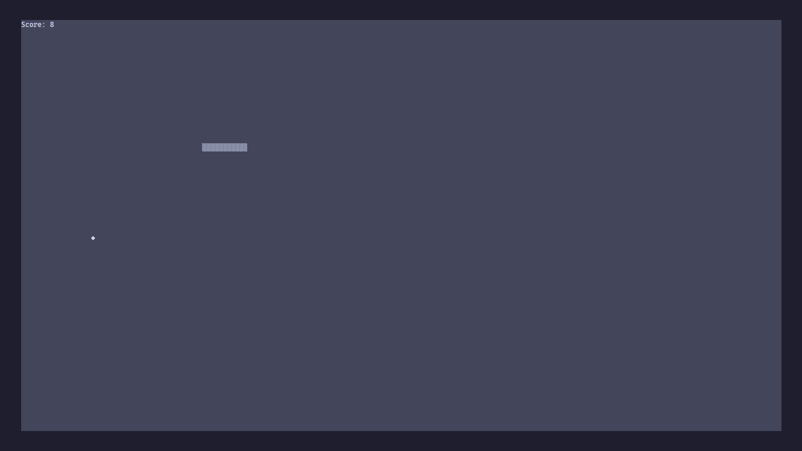

# Snake Game

A classic Snake game implemented in Python using the curses library for terminal-based gameplay.

## Description

Control a snake to eat food and grow longer while avoiding walls and your own tail. The game ends when the snake collides with the boundaries or itself.

## Requirements

- Python 3.x
- curses library (included with Python standard library on most systems)

## How to Run

Make the script executable and run it:

```bash
chmod +x snake
./snake
```

Or run directly with Python:

```bash
python3 snake
```

## Controls

- **Arrow Keys**: Move the snake (Up, Down, Left, Right)
- **R**: Restart the game after game over
- **Q**: Quit the game

## Gameplay

- Eat the diamond-shaped food (♦) to increase your score and grow the snake
- Avoid hitting the walls or the snake's own body
- The game speeds up as you progress

## Screenshot

